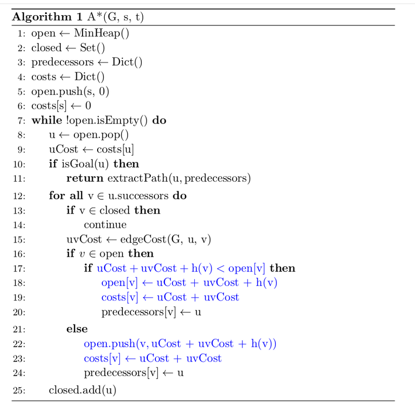

# Mission-Planning-in-Driving-Environments
**Idea of this project is to:**
* Implement Dijkstra's search algorithm on a road network graph.
* Implement the A* search algorithm using a Euclidean heuristic on a road network graph. 

In this we are implementing Dijkstra's search algorithm on a road network in Berkeley, California and then modifying this algorithm using a distance heuristic to perform A* search.

In this project, we will be relying on the [OSMNX library](https://osmnx.readthedocs.io/en/stable/) to generate Python graphs from Open Street Map (OSM) data. These graphs will be represented using the [NetworkX library](https://networkx.github.io/documentation/stable/). Both of these links are to the documentation, which you will find useful in this project.

## 1.Dijkstra's Search

Here is detail explaination of [Dijkstra's Algorithm](https://www.freecodecamp.org/news/dijkstras-shortest-path-algorithm-visual-introduction/#:~:text=Dijkstra's%20Algorithm%20finds%20the%20shortest,node%20and%20all%20other%20nodes. "Click to view").

To perform Dijkstra's search, we require a priority queue (or a min heap), which is defined as the `priority_dict` class. This class is accessed just as a standard dictionary is, except it orders the keys by their value. We can use the vertices as the keys to our priority queue, and their distance from the start as their value. For example, to set the distance of vertex `v` to the variable `dist`, we can do `open_queue[v] = dist`. To get the smallest value in the priority queue, we can use `priority_dict.pop_smallest()`. This returns a tuple of the vertex key and it's distance from the origin.

The main input to the search is the `graph`, an OSMNX graph representation of the road network. The vertices are stored as keys, and as such the origin is given as input as `origin_key` and the goal is given as `goal_key`. To get the outgoing edges of a given vertex `u`, we can use `graph.out_edges([u], data=True)`. The return value of this is a list of tuples, each of which represent an outgoing edge. The second element of each tuple is the outgoing vertex at the other end of the edge. You can iterate over this list of tuples using:

`for edge in graph.out_edges([u], data=True):`

and can get the outgoing vertex of these edges by accessing the 2nd element of the tuple:

`edge[1]`.

To get the weight of this edge, you can access the data stored in the 3rd element of the tuple:

`length = edge[2]['length']`.

For more details, you can refer to the NetworkX documentation [here](https://networkx.github.io/documentation/networkx-2.3/reference/classes/generated/networkx.DiGraph.out_edges.html?highlight=out_edges#networkx.DiGraph.out_edges).

## 2.A* Search

Here is detail explaination of [A* Algorithm](https://towardsdatascience.com/a-star-a-search-algorithm-eb495fb156bb "Click to view").

Next, we will use a distance heuristic to implement A* search for our map search problem. Since we are using real map data here, we will need to convert the data to a format which we can use for distance computation. Each data point has a latitude and longitude associated with it, which we then have to convert into (x, y, z) coordinates on the earth (which we will assume to be a sphere with radius 6371 km). We can then take the straight line distance between these two points as an approximation for the distance between them. Over small distances, this approximation is accurate.
Now, we can use our distance heuristic to perform A* search on our map. 

